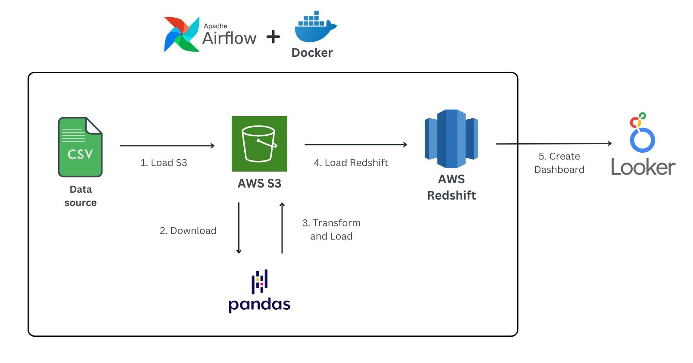
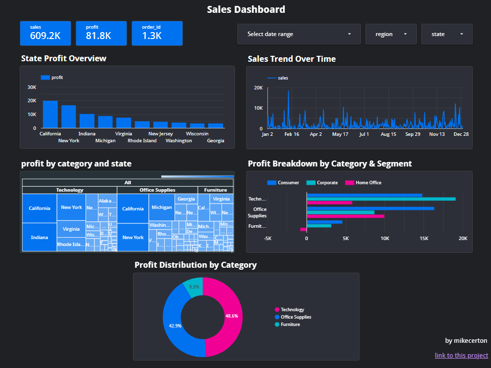
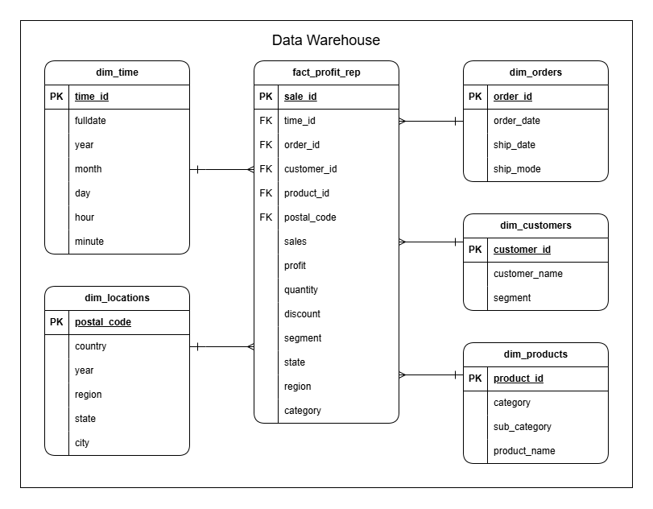
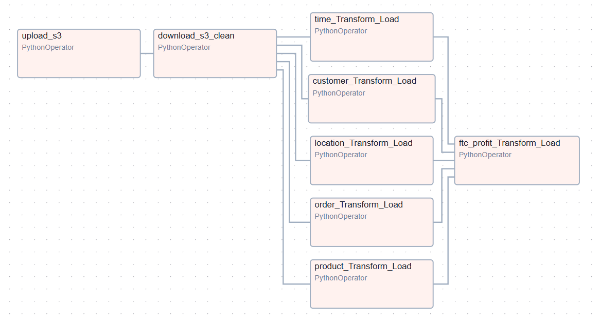

# The-Retail-ELT-Pipeline-End-To-End-project
## Overview
&emsp;The goal of this project is to design and implement an ETL data pipeline that ingests raw retail data, processes it, and stores it in a data warehouse for analysis and visualization. The pipeline is orchestrated using Apache Airflow, hosted locally with Docker Compose. AWS S3 serves as the data lake, while AWS Redshift functions as the data warehouse. Finally, the processed data is visualized using Looker Studio for insights and reporting.  
!! You can view the dashboard [here. ](https://lookerstudio.google.com/reporting/0ef16b84-55f2-47dc-afd0-f62f6d1a8bd4)!!  
## Architecture

1. Upload raw data to AWS S3 (data lake) to handle data from multiple sources. 
2. Download raw data from AWS S3 for processing. 
3. Transform the raw data into a suitable format for the data warehouse using Pandas and upload it back to AWS S3. 
4. Load the processed data from AWS S3 into AWS Redshift (data warehouse). 
5. Use data from the warehouse to create dashboards in Looker Studio for insights and reporting. 

## Dashboard

I use Looker Studio to create dashboards using data from the data warehouse.

!! You can view the dashboard [here. ](https://lookerstudio.google.com/reporting/0ef16b84-55f2-47dc-afd0-f62f6d1a8bd4)!!  
#### A special note
While developing this project, I connected Looker Studio to AWS Redshift for data. However, due to AWS free tier limits, Redshift cannot run continuously. As a result, the dashboard now uses data from a CSV file exported from Redshift, but it appears the same as when directly connected to Redshift.

### Data Warehouse

### DAG

## Tools & Technologies
- Cloud - Amazon Web Services (AWS)  
- Containerization - Docker, Docker Compose  
- Orchestration - Airflow  
- Transformation - pandas  
- Data Lake - AWS S3  
- Data Warehouse - AWS Redshift  
- Data Visualization - Looker Studio  
- Language - Python  

## set up
